# Fusion 360 Design Project
## **Step 1: Build Design and New Component**

### **1.1 (Bench Vise Assembly)**

This assembly consisting of Four components, here are the components

1.  Base

2.  Vice Jaw

3.  Jaw Screw

4.  Screw Bar

First create a new design by going to file select new design.

Go to documents setting and change the units to millimeter.

### **1.2 Assemble Section (New Component)**

-   In assemble section create a new component and give it a name Base.

## **Step 2: Design 3D Model**

### **2.1 Solid (Create)**

-   In create section create a new sketch on the front plane with
    required dimensions.

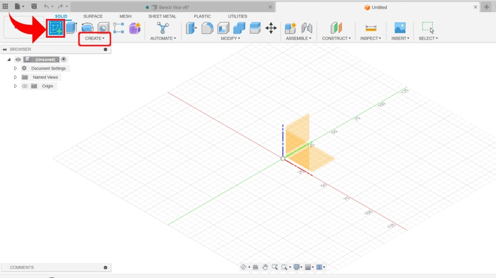

-   After Create Sketch click on Finish Sketch and then Use Extrude
    Command

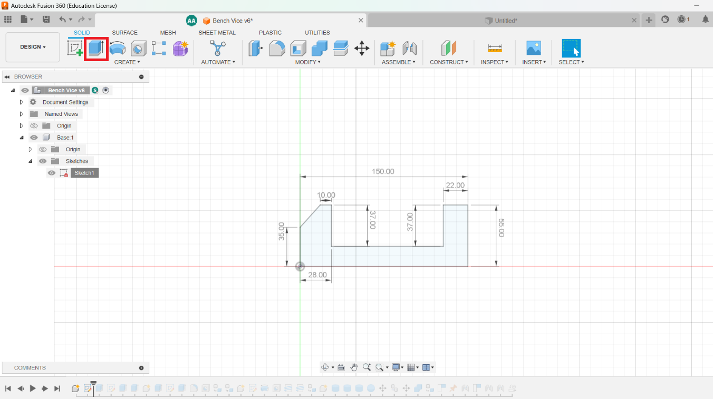

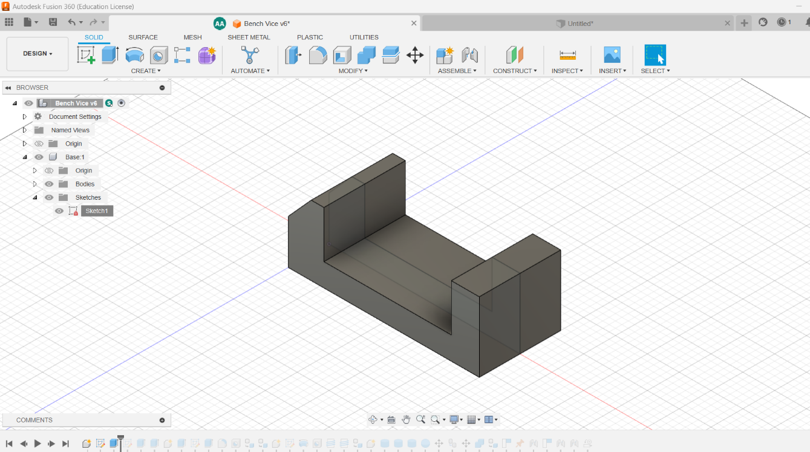

### **2.2 Construct Section (Tangent) & Modify (Fillet)**

-   We have used tangent tool to tangent the Circles which we created
    with circle tool in Create Section.

-   And we have used fillet feature which is present in Modify Section.

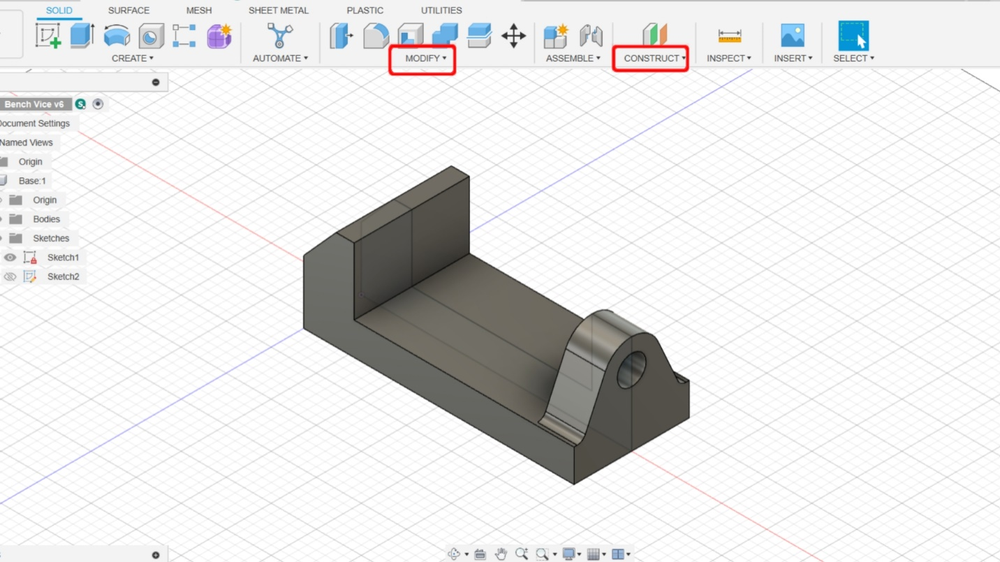

-   Now we use line command from create section and then after giving
    dimensions, we use vertical/horizontal tool from Constraints
    Section.

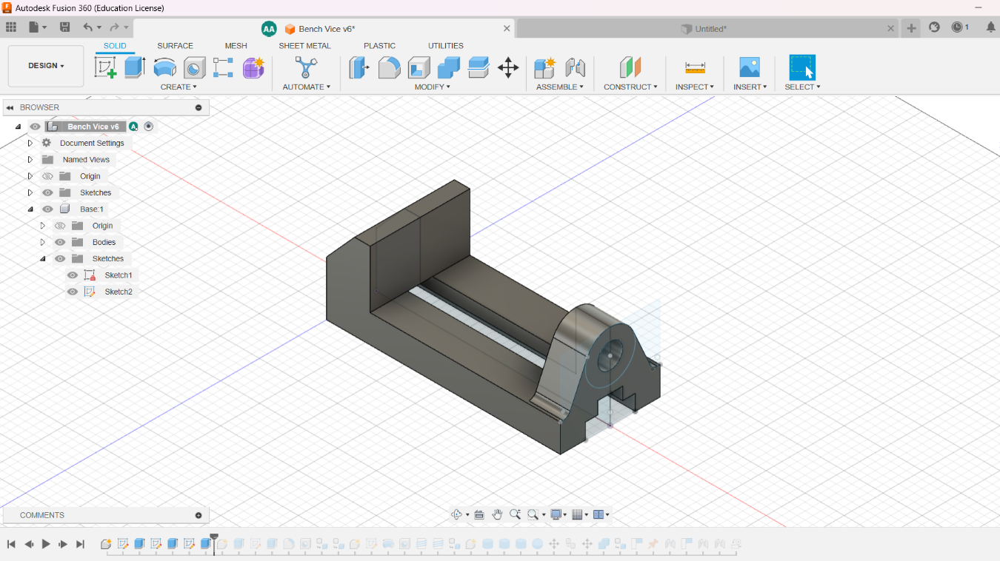

### **2.3 Inspect Section**

-   We use inspect Section to measure the distance between 2 points or
    to measure the angle between 2 points.

### **2.4 Remaining Components**

-   We have designed **Vice Jaw, Jaw Screw** and **Screw Bar**
    respectively.

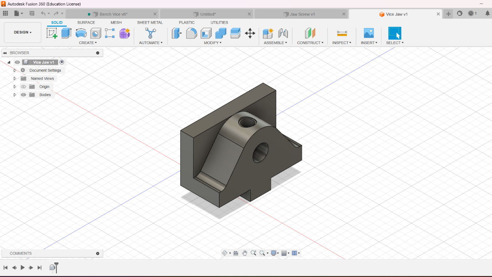

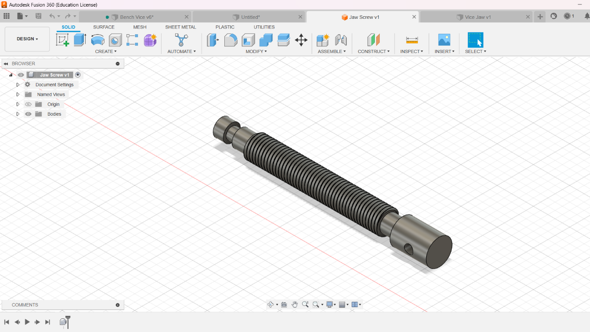

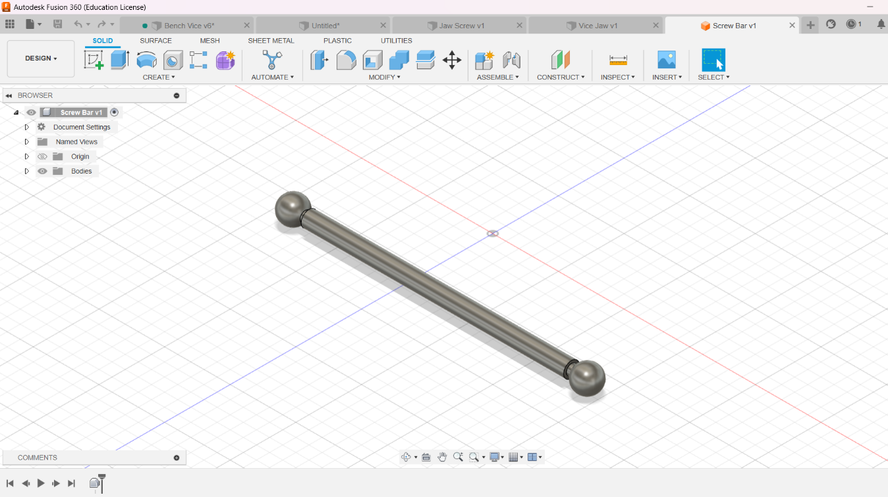

### **2.5 Assemble**

-   After designing all components, we used joint command in assemble
    section to join all the components.

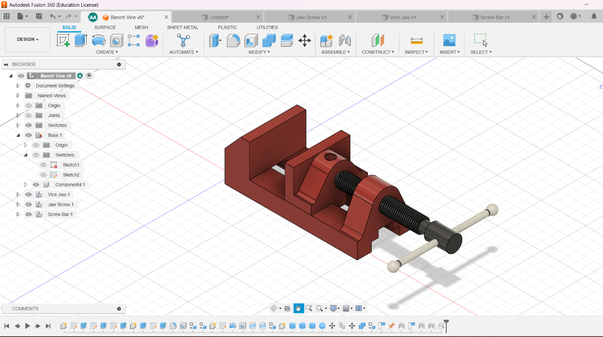

### **2.6 GIF of Working Condition**

### **2.7 Video of Design History**

## **Step 3: Motion Link**

### **Vice Jaw**

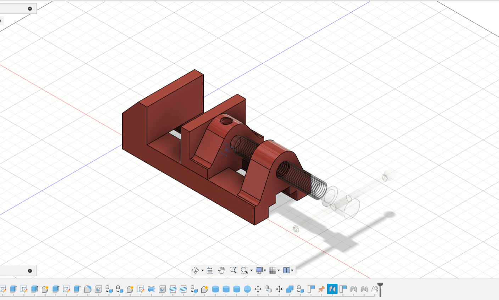

### **Jaw Screw**

 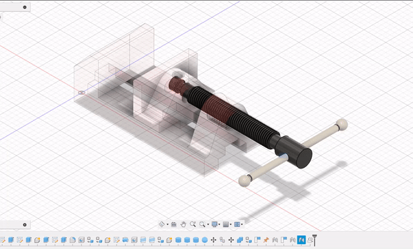