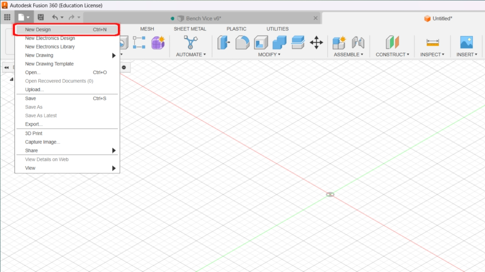
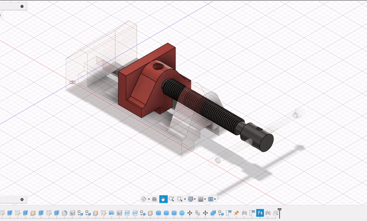

# Fusion 360 Design Project
## **Step 1: Build Design and New Component**

### **1.1 (Bench Vise Assembly)**

This assembly consisting of Four components, here are the components

1.  Base

2.  Vice Jaw

3.  Jaw Screw

4.  Screw Bar

First create a new design by going to file select new design.

Go to documents setting and change the units to millimeter.

### **1.2 Assemble Section (New Component)**

-   In assemble section create a new component and give it a name Base.

## **Step 2: Design 3D Model**

### **2.1 Solid (Create)**

-   In create section create a new sketch on the front plane with
    required dimensions.

-   After Create Sketch click on Finish Sketch and then Use Extrude
    Command

### **2.2 Construct Section (Tangent) & Modify (Fillet)**

-   We have used tangent tool to tangent the Circles which we created
    with circle tool in Create Section.

-   And we have used fillet feature which is present in Modify Section.

-   Now we use line command from create section and then after giving
    dimensions, we use vertical/horizontal tool from Constraints
    Section.

### **2.3 Inspect Section**

-   We use inspect Section to measure the distance between 2 points or
    to measure the angle between 2 points.

### **2.4 Remaining Components**

-   We have designed **Vice Jaw, Jaw Screw** and **Screw Bar**
    respectively.

### **2.5 Assemble**

-   After designing all components, we used joint command in assemble
    section to join all the components.

### **2.6 GIF of Working Condition**

### **2.7 Video of Design History**

## **Step 3: Motion Link**

### **Vice Jaw**

### **Jaw Screw**

 

### **Screw Bar**

### **Bench Vice Assembly**

## **Step 4: Install and Use Plugin**

   - First of all in Fusion 360 go to Utilities and then go to Add-Ins,
    make sure you are connected to the internet.

   - Then you see the option of Fusion 360 App Store, Click on it

-  Now Select your required Plugin and download it.

-  After download install the Plugin.

-  Now again go to Utilities and then in Add-Ins ( Scripts and Add-Ins)
    and go to Add-Ins and select the Plugin you Installed and Use it.

-  And then Click on Run. As i Installed FM Gear so to use this I have
    to go to Create Option and Select FM Gear.

-  Then Give your dimensions and Click on OK. It will Run and Create
    Your Design.

