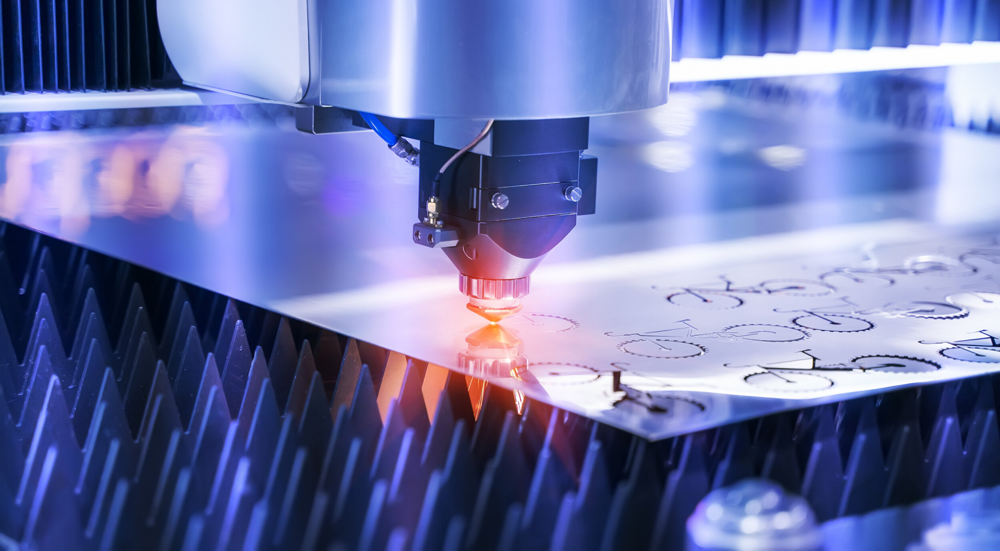
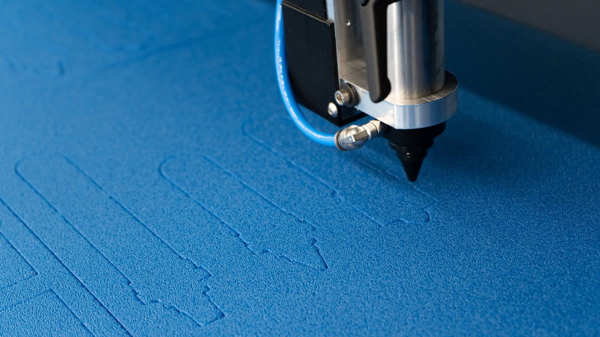
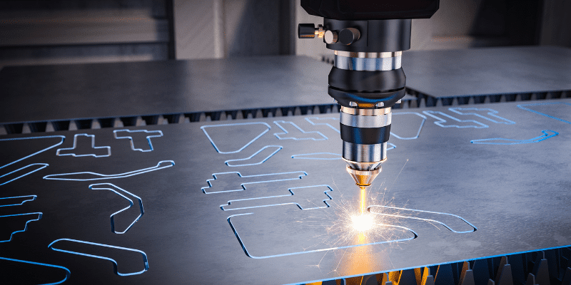
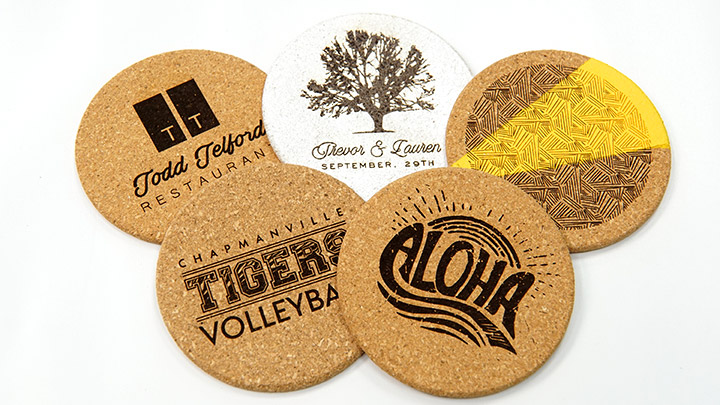
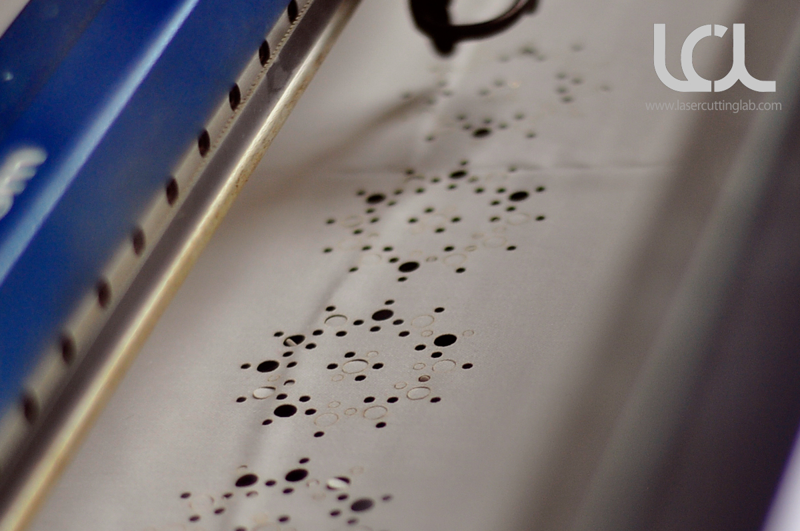

# Assesment

## What is Laser Cutting?

Laser cutting is a high precision CNC thermal process that uses a high-power laser beam to cut, melt, or burn a material sheet. It uses a focussed beam of light to cut and etch sheet material to the design specification. Ideal for a variety of material types (including metals, wood and polymers), it is capable of producing complicated parts without using a custom-designed tool.

The process is suitable for both one-off jobs and low, medium volume production due to its high repeatability. Laser cutting is particularly useful for the fabrication of metals (steel, brass, aluminum, or nickel). It has become a firm favorite in the production of medical products owing to its high precision, reliability, and resultant smooth finishes.

## Types Of Laser Cutting
For cutting, there are three primary types of lasers. They are CO2, Nd-YAG (neodymium yttrium aluminum garnet), and fiber lasers. They differ in the base material used to generate the laser beam.

### CO2 lasers
This type of laser has a gas discharge medium filled with 10-20% carbon dioxide, 10-20% nitrogen, trace amounts of hydrogen and xenon, and helium. Laser pumping is done not by light but by discharge current. As the discharge passes through the illumination medium, the nitrogen molecules are excited to a higher energy level. Unlike previously described, these excited nitrogen molecules do not lose energy due to photon emission. Instead, it transfers the energy of its vibrational modes to the CO2 molecules. This process continues until most CO2 molecules are in a transferable state. The carbon dioxide molecules then emit infrared light at 10.6 µm or 9.6 µm, bringing them to a lower energy level. Resonant mirrors are designed to reflect the emitted photons at these wavelengths. A mirror is a partial reflector that allows the release of the infrared beam used to cut the material. After releasing the infrared light, the CO2 molecule returns to the ground state by transferring its remaining energy to the doped helium atoms. The cold helium atoms then become very hot and are cooled by the laser’s cooling system. CO2 lasers have an efficiency of about 30%, higher than other lasers.

### Crystal (ruby, Nd and Nd-YAG) lasers
Unlike CO2 lasers, this type of laser is a solid-state laser that uses synthetic crystals as the light-emitting medium. The most common is a YAG (Y3Al5O12) crystal doped with 1% ionized neodymium (Nd3+).

The Nd ions in this crystal replace the Y ions in the crystal structure. The rods are approximately 10 cm in length and 6 to 9 cm in diameter. The ends of the YAG rods are polished and coated with a highly reflective material that serves as a resonator system.

A krypton flash or laser diode achieves laser pumping. This laser pumping excites neodymium ions to higher energy levels. After some time, the excited neodymium ions enter a lower, more stable state without emitting photons. This process continues until the medium is filled with excited Nd ions. From its degraded state, the Nd ion emits infrared light at a wavelength of 1064 nm.

### Fiber lasers
Fiber lasers are a newer form of laser that emits light using optical fibers rather than gases (CO2 lasers) or crystals (Nd-YAG lasers). Because it uses optical fibers, fiber lasers are solid-state lasers that work similarly to crystal lasers. The optical fiber is doped with elements such as erbium and ytterbium. Erbium produces light in the range of 1528 to 1620 nm. On the other hand, ytterbium produces light at 1030 nm, 1064 nm and 1080 nm.

It is known that when light passes through an optical fiber, it stays inside with minimal energy loss. This makes optical fibers more stable than other types requiring accurate alignment.

## Material used for laser Cutting:

### 1. Acrylic

Acrylic (PMMA) is a transparent plastic material known for its outstanding strength, optical clarity, and stiffness. There are two forms of acrylic: cast and extruded. Extruded sheet is harder to cut because residual stresses result in stress cracking. Slower cutting of extruded acrylic can leave better-looking cut edges. Ventilation is required when laser cutting acrylic because the vapor is an ignition risk and is toxic.

### 2. Plywood

Plywood is made from bonded wood veneers. While many forms of plywood are marketed, all plywood can be laser cut. Plywood is bonded with resins and produces toxic gasses when heated. It is therefore recommended to use ventilation when cutting.

Plywoods require high power and fast speeds when performing multiple cuts—which may result in an increase in kerf size. Higher blower pressure will result in cleaner cutting and allow higher feed rates. The recommended laser types are CO2 and fiber lasers. 

.png>)

### 3. MDF

MDF (Medium Density Fiberboard) sheet is an engineered material made with hardwood or softwood residuals. It is not an easy material to laser cut because its density and high adhesive content make it slow to cut and easy to produce staining and soot marking. MDF’s high density requires slow cut speeds and results in high HAZ and wide kerfing. It is recommended to use CO2 or a diode-pumped laser when cutting MDF. 

When cutting MDF, it is necessary to use the highest power available. An 80 W laser cuts 10 mm MDF at about 3.5 mm/s with scorched and stained edges. The blower pressure also needs to be high. There will be burned residue to blow away, to allow the laser to pass and avoid depositing soot/residues on the optics. 

### 4. Cardboard

Cardboard is a generic term for heavy paper-based products. It is a low-cost material used extensively for product packaging, modeling, and advertising. All laser types work well with cardboard.

When laser cutting cardboard, it is recommended to maintain ventilation. However, the volume of combustion products will be low, and cardboard has no significant toxicity. Additionally, use moderate power levels and fast feed speeds. Kerfing will also be limited and the HAZ will be small. Blower pressure should be set low, as the material can be lifted by air pressure, but some flow will make for better cut quality.

### 5. Foam

A foam is a broad term that refers to materials formed by trapping pockets of gas in a liquid or solid. It encompasses a range of materials, some of which can be laser cut, several of which cannot. Some cuttable examples are: expanded polystyrene or polypropylene foams, Depron modeling foam, foam-cored boards like Gatorfoam, and EVA foam. There is no simple recommendation of a laser type, as foams belong to a range of material types—but any laser type is likely to cut well.

Laser cutting of foams requires very low power and high feed rates, good ventilation, and a breathing mask, as most foams release toxic gasses when heated. Blowers should also be set to a low level for thin materials.

### 6. Metal

Metal is a family of materials requiring high power to cut anything thicker than foil. Some metals work best with fiber lasers or solid-state, but others work with CO2 lasers. Cut quality is a result of laser power, pulsation, beam diameter, focal depth, and light frequency. Metals produce little by way of gas or residues and generally exhibit low toxicity, although normal precautions should still be applied. 

Two methods are employed in the laser cutting of metals: reactive laser cutting and fusion cutting. Reactive laser cutting uses an oxygen jet in the cut to accelerate the cutting by oxidation. For thicker steel sections and titanium, the metal is rapidly oxidized and/or melted and then blown out of the cut area. Fusion cutting, on the other hand, is used to cut aluminum, stainless steel, copper, nickel, and tungsten. This technique uses a blend of nitrogen and argon to blow molten metal away from the cut. 

### 7. Leather

A leather is a strong and flexible material that is traditionally made of animal skins, although faux leather (artificial) is now available. CO2 lasers are generally the most effective at cutting leather. Modestly powered lasers will make good cuts in leather, although multiple passes may be required. Laser cutting in leather is clean and leaves no torn or damaged fibers. Laser cutting leather avoids the stress distortion that occurs with even the sharpest hand tools. 

.png>)

### 8. Plastic

Plastic is another broad classification that contains materials that cut well. Some of the plastic materials suitable for laser cutting are polyimide (Kapton®) and polyester (Mylar®) which cut well using diode laser and CO2 lasers respectively. Polycarbonate sheet, on the other hand, can be cut at 1 mm max, but the HAZ yellows and can distort. Polystyrene also cuts cleanly but tends to produce a lot of smoke and releases toxic styrene gas. Cut quality is a result of influences in laser power, pulsation, beam diameter, focal depth, (for thicker cuts), and light frequency (laser type). No two plastics have the same requirements. All plastics produce toxic gas or residues, and these pose serious health risks, so precautions are recommended.

.png>)

### 9. Cork

Cork is the bark of the cork oak and is usually used in manufactured sheets. For cork, up to 3 mm thick, the speed of cut should be fairly fast, tens of millimeters per second. Thicker cork mats will require multiple passes for good cutting. Start with quite low power and increase until a smoke-free cut is achieved. The blower should be set to a high level, but not high enough to lift the sheet or cut areas. 

### 10. Textiles

Natural textiles such as cotton, silk, and wool are great candidates for laser cutting. Low to moderate power and high feed rates will generally give excellent cut quality. Blower use is beneficial but must be at low pressure to prevent the fabric from being displaced and lifted. Synthetic fabrics can pose some issues as the line between melting the cut line and creating a fire can be quite narrow. There are no general settings that ensure good results. However, synthetic fabrics work well for laser cutting, once stable settings can be achieved.

### 11. Paper

Paper is very well suited to laser cutting. Any small laser-cutting machine will do a great job with paper, but it’s not well suited to larger industrial machines. Paper requires low power settings and high feed speeds, as it cuts very fast. Heavier papers may need slightly lower feed rates. Very clean cuts with no visible HAZ can be made.

.jpg>)